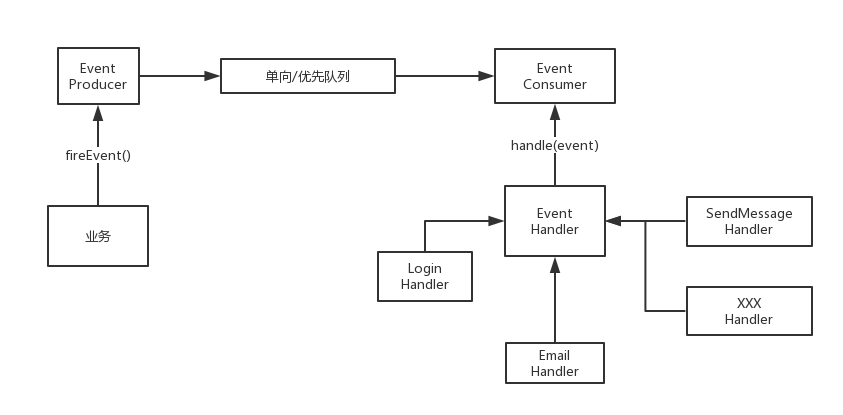

# online-questioning 在线问答平台, 这是我模仿知乎做的一个问答交流平台，类似贴吧那种，具有的功能：能发帖，回复，评论，站内私信，邮件服务等

使用到的技术栈：  
1、spring/springboot  
* intercepter拦截器实现登录权限控制 
* javax.mali邮件服务，如有新评论时发邮件通知用户，注册时邮件验证 
* ioc项目容器中对象管理，对容器中beans操作 
* aop平台日志操作记录 
* maven管理整个项目依赖   
2、mybatis操作数据库主要业务数据   
3、前端模板引擎freemarker ，渲染整个前端模板  
4、算法设计：trie前缀树实现网站敏感词过滤  
5、Redis实现异步队列，利用多线程实现异步事件处理，主要针对一些耗时操作，进行异步执行，如发邮件，评论后发站内私信通知等  
6、使用 Redis 数据结构中的 set 集合实现用户对问题评论的点赞点踩功能  
7、solr导入mysql数据，建立问题和标题文档库，利用ik-analyzer进行中文分词，用户可以进行站内全文搜索  

开发通用的新模块流程：  
1、数据库设计  
2、Model：模型定义，与数据库相匹配  
3、Dao层：数据操作  
4、Service:服务包装  
5、Controller：业务入口，数据交互  
6、单元测试  

## 注册模块：  
1. 用户名合法性检测（长度，敏感词，重复，特殊字符）  
2. 密码长度要求  
3. 密码salt加密，密码强度检查（md5库）  
4. 用户注册邮件激活  

我在实现用户注册邮箱激活时自己的实现思路：  
当用户提交注册表单信息时，把表单信息存到redis的hash数据结构中，同时产生一个对应的key，  
这时发布一个异步事件，发送一封邮件，同时把这个key放到链接中发到用户的注册邮箱中，当用户  
访问邮箱中这个链接时，在redis中查出这个key对应的注册信息，并存到数据库中完成注册  
```
  //信息存到redis中
        String register_ticket=OnlineQUtil.MD5(email);
        redisAdapter.hset(register_ticket,"email",email);
        redisAdapter.hset(register_ticket,"username",username);
        redisAdapter.hset(register_ticket,"password", password);
        redisAdapter.expire(register_ticket,60*15);
        redisAdapter.sadd("email",email);
  //发布异步事件
        eventProducer.fireEvent(new EventModel(EventType.REGISTER)
        .setExt("register_ticket",register_ticket)
        .setExt("email",email));
  //发送邮件
      @Override
      public void doHandle(EventModel model) {
          Map<String ,Object> map=new HashMap<>();
          map.put("url","http://127.0.0.1:8080/regVerify?p="+model.getExt("register_ticket"));
          mailSender.sendWithHTMLTemplate(model.getExt("email"),"<我的知乎——在线问答平台>注册激活邮件",
                  "mails/register_email.html", map);
      }
   //从redis中读取注册信息，完成注册
   if(redisAdapter.exists(p)){
               try {
                   String email=redisAdapter.hget(p,"email");
                   String username=redisAdapter.hget(p,"username");
                   String password=redisAdapter.hget(p,"password");
                }
                ...
     }
  
```

## 登录模块
1、服务器密码校验/三方校验，token（sessionId或者cookie的一个key）登记  
* 服务器端token关联userId  
* 客户端存储token(本地或者cookie)  

2、服务器端/客户端token设置有效期（记住登录）  
3、登出：服务器端/客户端token删除或者session清理  

## 问题发布模块
* HTML/敏感词过滤
```
  //html过滤
  question.setContent(HtmlUtils.htmlEscape(question.getContent()));
  敏感词过滤通过Trie树存储敏感词汇，匹配文本串，对匹配到的敏感词打码或者删除
```
* 多线程

### 关于多线程的一些运用知识回顾如下：  
```
  Future作用：进行线程与线程间通信
  1. 返回异步结果：Future<Integer>future =service.submit(new Callable<Integer>{ });
  2. 阻塞等待返回结果（future.get()）
  3. timeout(future.get(100,TimeUnit.MILLISECONDS))
  4. 获取线程中的Exception
```

### 评论中心

### 消息中心（赞，评论通知，私信通知，回答采纳等）
### Redis数据结构使用场景

|      |                    List                    |                        Set                         |    SortedSet     |       Hash       |                      KV                      |
| :--: | :----------------------------------------: | :------------------------------------------------: | :--------------: | :--------------: | :------------------------------------------: |
| 用途 | 栈操作，双向列表，使用于最新列表，关注列表 | 适用于无顺序的集合，点赞点踩，抽奖，已读，共同好友 | 排行榜，优先队列 | 对象属性，不定长 | 单一数值，验证码，PV(page views)点击量，缓存 |
| api  |                   lpush                    |                       sdiff                        |       zadd       |       hset       |                     set                      |
| api  |                    lpop                    |                      smembers                      |      zscore      |       hget       |                    setex                     |
| api  |                   blpop                    |                       sinter                       |      zrange      |     hgetAll      |                     incr                     |
| api  |                   lindex                   |                       scard                        |      zcount      |     hexists      |                                              |
| api  |                   lrange                   |                                                    |      zrank       |      hkeys       |                                              |
| api  |                    lrem                    |                                                    |     zrevrank     |      hvals       |                                              |
| api  |                  linsert                   |                                                    |                  |                  |                                              |
| api  |                    lset                    |                                                    |                  |                  |                                              |
| api  |                   rpush                    |                                                    |                  |                  |                                              |

### 例如：实现PV(page views)点击量功能等

* 点赞(Set) 操作：sadd, srem, sismembers等
* 关注(Set)
* 排行榜(SortedSet)
* 验证码(KV)
* 缓存(序列化存KV)
* 异步队列(中间层)
* 判断队列(中间层)

### 异步队列实现

  

例如：实现评论后给提问者发一条站内通知功能

### 问题评论邮件通知功能实现，手写一个异步实现代码
思路：  
* 自己手动实现一个异步队列
* 用redis做异步消息队列实现，利用多线程来实现异步发送邮件  
* 用javax.mail发送邮件，使用smtps协议
技术关键流程：  
1、定义消息事件接口  
```
public interface EventHandler {

    void doHandle(EventModel model);

    List<EventType> getSupportEventTypes();
}
```
2、定义消息模型,可以用map的数据结构来实现  
3、定义生产者，发布消息到redis构建的异步队列中(利用redis的阻塞队列操作)  
```
public class EventProducer {
    @Autowired
    private RedisAdapter redisAdapter;
    public boolean fireEvent(EventModel eventModel) {
        try {
            String json = JSONObject.toJSONString(eventModel);
            String key = RedisKeyUtil.getEventQueueKey();
            redisAdapter.lpush(key, json);
            return true;
        } catch (Exception e) {
            return false;
        }
    }
}
```  
4、发布事件  
5、定义消费者，开启多线程异步处理事件  
```
         Thread thread =new Thread(new Runnable() {
             @Override
             public void run() {
                 while (true){
                     String key= RedisKeyUtil.getEventQueueKey();
                     List<String> events =redisAdapter.brpop(0,key);
                     for(String message:events){
                         //消息队列的第一个值可能是key,返回值的原因
                         if(message.equals(key)){
                             continue;
                         }
                         EventModel eventModel= JSON.parseObject(message,EventModel.class);
                         if(!config.containsKey(eventModel.getType())){
                             logger.error("不能识别的事件");
                             continue;
                         }
                         for(EventHandler handler :config.get(eventModel.getType())){
                             handler.doHandle(eventModel);
                         }
                     }
                 }
             }
         });
         thread.start();
```

### 关注服务，如A关注了某人，某问题
分一下功能点：  
* 首页问题关注数
* 详情页问题关注列表
* 粉丝/关注人列表
* 关注接口设计，关注列表分页
* 关注异步事件处理

存储结构：
redis: zset / list

### 平台内容排序算法：
1、Score = (P-1)/(T+2)^G  
P表示投票数，G表示分值根据时间降低速率，相当于重力加速度，T表示发布到现在时间间隔，单位小时    
2、f(t,x,y,z)=log z + yt/45000  
t等于发布到现在的时间差，如一个差86400秒  
x等于赞数-踩数  
如果x大于0则y=1,x小于0则y=-1，x=0则y=0  
z等于x的绝对值，如果x=0，则z=1  
